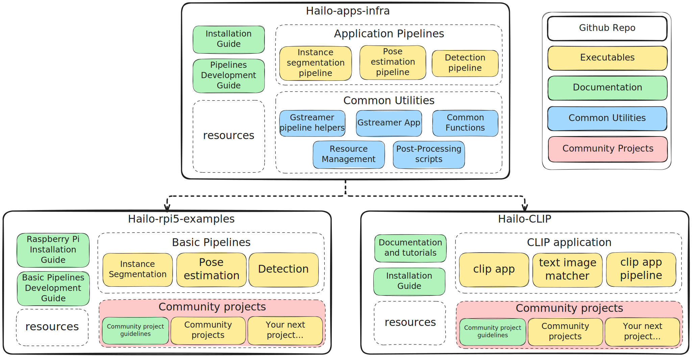

## Cloned from: [hailo-rpi5-examples](https://github.com/hailo-ai/hailo-rpi5-examples) (*Note: Unneeded files have been removed*)  
### New machine vision source file, for autonamous driving can be found here: [Machine Vision Self-Driving](https://github.com/Starman7312/Robotic-Car-Project/tree/69d1f6020dd72dd2643703d5c172a540a147b5b8/Autonamous%20Driving%20Code/hailo-rpi5-examples-main/Machine%20Vision%20Self-Driving)

------------------------------------------------------------

# Hailo Raspberry Pi 5
The examples in this repository are designed to work with the Raspberry Pi AI Kit and AI HAT, supporting both the Hailo8 (26 TOPS) and Hailo8L (13 TOPS) AI processors. The examples can also be run on an x86_64 Ubuntu machine with the Hailo8/8L AI processor.
Visit the [Hailo Official Website](https://hailo.ai/) and [Hailo Community Forum](https://community.hailo.ai/) for more information.

## Install Hailo Hardware and Software Setup on Raspberry Pi

For instructions on how to set up Hailo's hardware and software on the Raspberry Pi 5, see the [Hailo Raspberry Pi 5 installation guide](doc/install-raspberry-pi5.md#how-to-set-up-raspberry-pi-5-and-hailo).


# Hailo RPi5 Basic Pipelines
This repo is using our new [Hailo Apps Infra](https://github.com/hailo-ai/hailo-apps-infra) repo as a dependency.
See our Developement Guide for more information on how to use the pipelines to create your own custom pipelines.

## Installation

### Clone this Repository
**It is assumed you have already cloned this entire source repository: [Robotic Car Project](https://github.com/Starman7312/Robotic-Car-Project)** 

Navigate to the repository directory:
```bash
cd hailo-rpi5-examples
```

### Installation
Run the following script to automate the installation process:
```bash
chmod +x install.sh
./install.sh
```

### Documentation
For additional information and documentation on how to use the pipelines to create your own custom pipelines, see the [Basic Pipelines Documentation](doc/basic-pipelines.md).

### Running The Code
When opening a new terminal session, ensure you have sourced the environment setup script:
```bash
source setup_env.sh
```
### Autonamous Drive Software

#### Run the autonamous drive software:
This is the full detection example, including object tracker and multiple video resolution support - see more information [Detection Example Documentation](doc/basic-pipelines.md#detection-example):

```bash
python "Machine Vision Self Drive/robot.py" --input rpi
```
To close the application, press `Ctrl+C`.

#### Running with USB camera input (webcam):
There are 2 ways:

Specify the argument `--input` to `usb`:
```bash
python "Machine Vision Self Drive/robot.py" --input usb
```

This will automatically detect the available USB camera (if multiple are connected, it will use the first detected).

Second way:

Detect the available camera using this script:
```bash
get-usb-camera
```
Run example using USB camera input - Use the device found by the previous script:
```bash
python "Machine Vision Self Drive/robot.py" --input /dev/video<X>
```

For additional options, execute:
```bash
python "Machine Vision Self Drive/robot.py" --help
```

#### Retrained Networks Support
This application includes support for using retrained detection models. For more information, see [Using Retrained Models](doc/basic-pipelines.md#using-retrained-models).

# Additional Examples and Resources



## Hailo Apps Infra
Hailo RPi5 Examples are using the [Hailo Apps Infra Repository](https://github.com/hailo-ai/hailo-apps-infra) as a dependency. The Hailo Apps Infra repository contains the infrastructure of Hailo applications and pipelines.
It is aimed for to provide tools for developers who want to create their own custom pipelines and applications. It features a simple and easy-to-use API for creating custom pipelines and applications.
It it installed as a pip package and can be used as a dependency in your own projects. See more information in its documentation and Development Guide.

#### rpicam-apps

Raspberry Pi [rpicam-apps](https://www.raspberrypi.com/documentation/computers/camera_software.html#rpicam-apps) Hailo post-processing examples.
This is Raspberry Pi's official example for AI post-processing using the Hailo AI processor integrated into their CPP camera framework.
The documentation on how to use rpicam-apps can be found [here](https://www.raspberrypi.com/documentation/computers/ai.html).

#### picamera2

Raspberry Pi [picamera2](https://github.com/raspberrypi/picamera2) is the libcamera-based replacement for Picamera, which was a Python interface to the Raspberry Pi's legacy camera stack. Picamera2 also presents an easy-to-use Python API.

## License

This project is licensed under the MIT License. See the [LICENSE](LICENSE) file for details.
